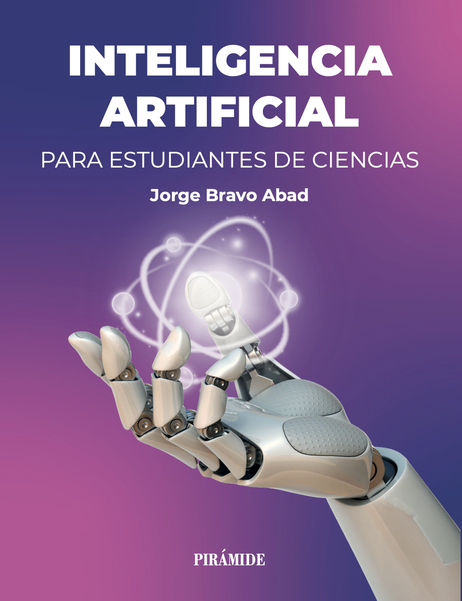

# Inteligencia artificial para estudiantes de ciencias

<p align="center">
  
</p>

**Material complementario del libro**

> Jorge Bravo Abad
> *Inteligencia artificial para estudiantes de ciencias*
> Ediciones Pirámide (Grupo Anaya), 1.ª edición, septiembre de 2026
> ISBN: 978-84-368-5167-0

Este repositorio contiene el código que acompaña al libro: un *notebook* de Jupyter por capítulo, listo para ejecutarse en Google Colab sin instalar nada, y la versión en *script* de Python (`.py`) de cada uno de ellos.

Todos los ejemplos utilizan datos sintéticos inspirados en problemas científicos reales (espectroscopía, propiedades moleculares, transiciones de fase, ciencia de materiales, series temporales físicas…), de modo que cada técnica se aprende en el contexto en el que un estudiante de ciencias la va a usar.

## Contenido por capítulos

Los capítulos 1 (*El paisaje de la IA para científicos*) y 14 (*Temas avanzados y fronteras*) son conceptuales y no tienen código asociado.

### Bloque I · Fundamentos

| Capítulo | Notebook | Abrir en Colab | Script |
|---|---|---|---|
| 2. El problema central: aprender sin memorizar | [`cap02_generalizacion.ipynb`](notebooks/cap02_generalizacion.ipynb) | [](https://colab.research.google.com/github/jorgebravoabad/ia-ciencias/blob/main/notebooks/cap02_generalizacion.ipynb) | [`cap02_generalizacion.py`](codigo/cap02_generalizacion.py) |
| 3. Fundamentos matemáticos del aprendizaje | [`cap03_fundamentos.ipynb`](notebooks/cap03_fundamentos.ipynb) | [](https://colab.research.google.com/github/jorgebravoabad/ia-ciencias/blob/main/notebooks/cap03_fundamentos.ipynb) | [`cap03_fundamentos.py`](codigo/cap03_fundamentos.py) |

### Bloque II · Métodos clásicos

| Capítulo | Notebook | Abrir en Colab | Script |
|---|---|---|---|
| 4. Regresión | [`cap04_regresion.ipynb`](notebooks/cap04_regresion.ipynb) | [](https://colab.research.google.com/github/jorgebravoabad/ia-ciencias/blob/main/notebooks/cap04_regresion.ipynb) | [`cap04_regresion.py`](codigo/cap04_regresion.py) |
| 5. Clasificación | [`cap05_clasificacion.ipynb`](notebooks/cap05_clasificacion.ipynb) | [](https://colab.research.google.com/github/jorgebravoabad/ia-ciencias/blob/main/notebooks/cap05_clasificacion.ipynb) | [`cap05_clasificacion.py`](codigo/cap05_clasificacion.py) |
| 6. Aprendizaje no supervisado | [`cap06_no_supervisado.ipynb`](notebooks/cap06_no_supervisado.ipynb) | [](https://colab.research.google.com/github/jorgebravoabad/ia-ciencias/blob/main/notebooks/cap06_no_supervisado.ipynb) | [`cap06_no_supervisado.py`](codigo/cap06_no_supervisado.py) |
| 7. Buenas prácticas y flujo de trabajo científico | [`cap07_buenas_practicas.ipynb`](notebooks/cap07_buenas_practicas.ipynb) | [](https://colab.research.google.com/github/jorgebravoabad/ia-ciencias/blob/main/notebooks/cap07_buenas_practicas.ipynb) | [`cap07_buenas_practicas.py`](codigo/cap07_buenas_practicas.py) |

### Bloque III · Aprendizaje profundo

| Capítulo | Notebook | Abrir en Colab | Script |
|---|---|---|---|
| 8. Redes neuronales densas | [`cap08_redes_densas.ipynb`](notebooks/cap08_redes_densas.ipynb) | [](https://colab.research.google.com/github/jorgebravoabad/ia-ciencias/blob/main/notebooks/cap08_redes_densas.ipynb) | [`cap08_redes_densas.py`](codigo/cap08_redes_densas.py) |
| 9. Redes neuronales convolucionales | [`cap09_cnn.ipynb`](notebooks/cap09_cnn.ipynb) | [](https://colab.research.google.com/github/jorgebravoabad/ia-ciencias/blob/main/notebooks/cap09_cnn.ipynb) | [`cap09_cnn.py`](codigo/cap09_cnn.py) |
| 10. Redes neuronales recurrentes y series temporales | [`cap10_rnns.ipynb`](notebooks/cap10_rnns.ipynb) | [](https://colab.research.google.com/github/jorgebravoabad/ia-ciencias/blob/main/notebooks/cap10_rnns.ipynb) | [`cap10_rnns.py`](codigo/cap10_rnns.py) |
| 11. Modelos generativos | [`cap11_generativos.ipynb`](notebooks/cap11_generativos.ipynb) | [](https://colab.research.google.com/github/jorgebravoabad/ia-ciencias/blob/main/notebooks/cap11_generativos.ipynb) | [`cap11_generativos.py`](codigo/cap11_generativos.py) |

### Bloque IV · Arquitecturas modernas y fronteras

| Capítulo | Notebook | Abrir en Colab | Script |
|---|---|---|---|
| 12. Transformers y mecanismo de atención | [`cap12_transformers.ipynb`](notebooks/cap12_transformers.ipynb) | [](https://colab.research.google.com/github/jorgebravoabad/ia-ciencias/blob/main/notebooks/cap12_transformers.ipynb) | [`cap12_transformers.py`](codigo/cap12_transformers.py) |
| 13. Aprendizaje por refuerzo | [`cap13_refuerzo.ipynb`](notebooks/cap13_refuerzo.ipynb) | [](https://colab.research.google.com/github/jorgebravoabad/ia-ciencias/blob/main/notebooks/cap13_refuerzo.ipynb) | [`cap13_refuerzo.py`](codigo/cap13_refuerzo.py) |

## Cómo usar este material

### Opción 1 · Google Colab (recomendada, sin instalación)

Pulsa el botón *Open in Colab* del capítulo que quieras. Todas las dependencias principales ya vienen preinstaladas en Colab; los pocos notebooks que necesitan paquetes adicionales (`shap`, `scikit-optimize`, `transformers`) incluyen la celda de instalación correspondiente al principio.

### Opción 2 · Instalación local

```bash
git clone https://github.com/jorgebravoabad/ia-ciencias.git
cd ia-ciencias
python -m venv .venv
source .venv/bin/activate        # En Windows: .venv\Scripts\activate
pip install -r requirements.txt
jupyter lab
```

### Opción 3 · Scripts de Python

La carpeta [`codigo/`](codigo/) contiene el código de cada notebook como *script* independiente, con las secciones del capítulo marcadas como comentarios:

```bash
python codigo/cap04_regresion.py
```

## Reproducibilidad

Todos los notebooks fijan las semillas de los generadores de números aleatorios, por lo que los resultados y figuras son reproducibles. Pequeñas diferencias numéricas pueden aparecer entre versiones de las bibliotecas o entre CPU y GPU, especialmente en los capítulos de aprendizaje profundo.

## Cómo citar

Si este material te resulta útil en docencia o investigación:

```bibtex
@book{bravoabad2026ia,
  author    = {Bravo Abad, Jorge},
  title     = {Inteligencia artificial para estudiantes de ciencias},
  publisher = {Ediciones Pir{\'a}mide},
  year      = {2026},
  isbn      = {978-84-368-5167-0}
}
```

## Licencia

El código de este repositorio se distribuye bajo licencia [MIT](LICENSE). El texto del libro está protegido por derechos de autor y es propiedad de © Jorge Bravo Abad y Ediciones Pirámide (Grupo Anaya, S. A.), 2026.

## Autor

**Jorge Bravo Abad** — Profesor Titular de Física en la Universidad Autónoma de Madrid e investigador en IFIMAC (Condensed Matter Physics Center).

¿Has encontrado una errata o un problema en el código? Abre un [*issue*](https://github.com/jorgebravoabad/ia-ciencias/issues); las contribuciones son bienvenidas.
